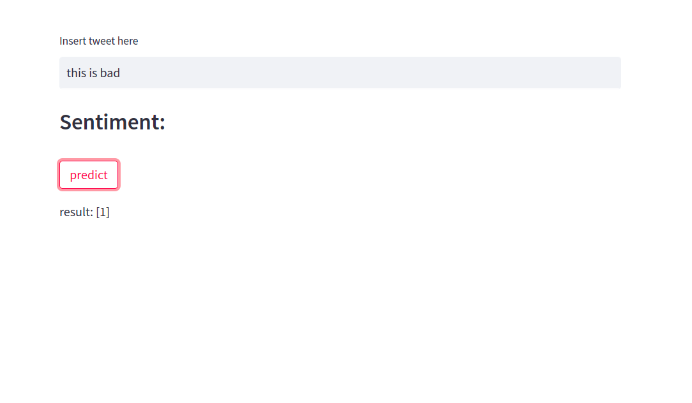
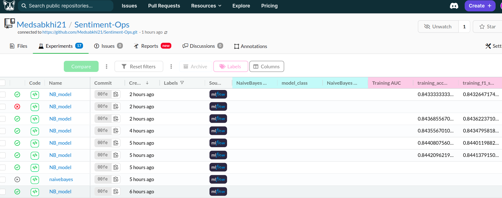
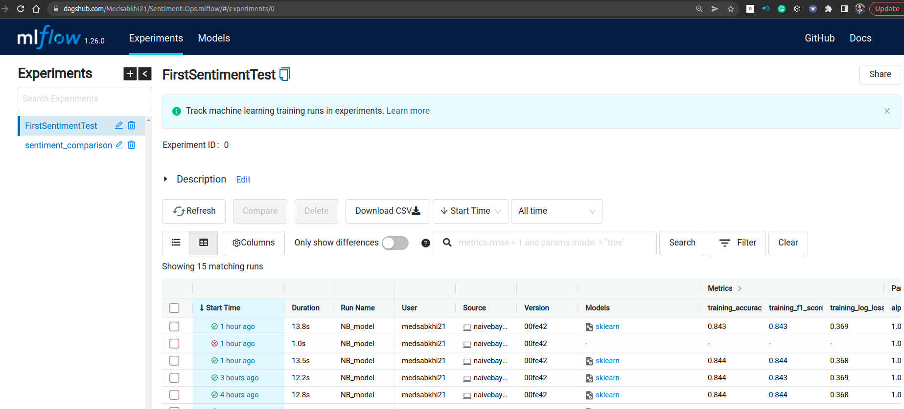
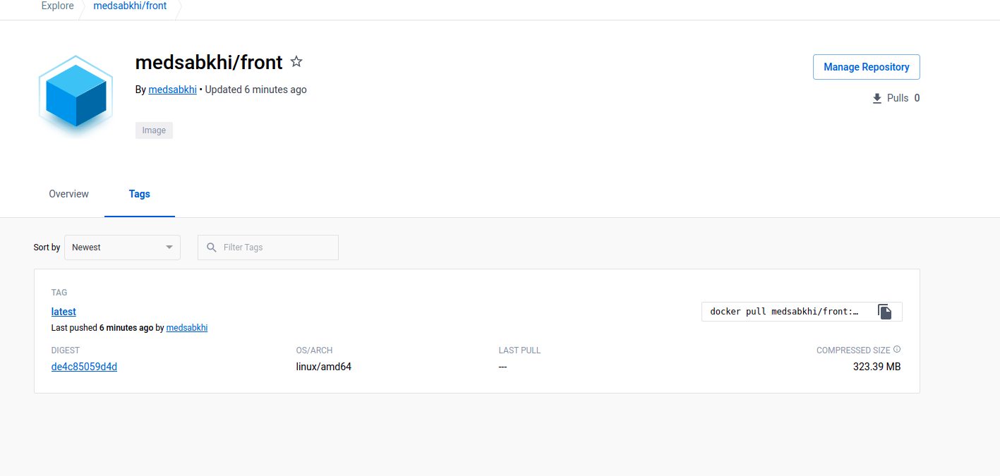

# Sentiment-ops
A sentiment analysis ML model using Text.
trained on Twitter Dataset from kaggle. Experiments Tracked with MLFLOW using a [Dagshub connected repository](https://dagshub.com/Medsabkhi21/Sentiment-Ops). 
The Project has a docker image that can be found on DockerHub [repository](https://hub.docker.com/u/medsabkhi).
Moreover, the CI/CD pipelines Are implemented using Jenkins As shown in the Screenshots.
## Streamlit App

## DagsHub experiments

## MLflow experiments with Dagshub

## Dockerhub

## CD Job

## CI Pipeline Job

